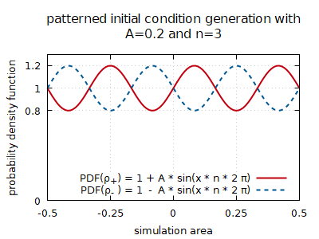
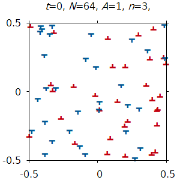

# 2D4::init_config_gen
The initial configuration generator tool for 2D4, a 2D discrete dislocation dynamics simulation program toolset.

## Short description
With this tool one can create dislocation configurations to use as an input of the simulation program 2D_DDD_simulation. It uses a platform independent implementation provided by [`boost.random`](https://www.boost.org/doc/libs/1_70_0/doc/html/boost_random.html).

## Dependencies
There is 1 new dependency: [`boost.random`](https://www.boost.org/doc/libs/1_70_0/doc/html/boost_random.html). To compile this project you need boost's program options and random libraries. The first is already a requirement for the project *2D_DDD_simulation*.

## Usage
Type `init_config_gen --help` to get the help. The program accepts the following arguments:
* `--N arg` or `-N arg`: **mandatory** argument. The number of dislocations to simulate. Must be an even number, because the same amount of positive and negative dislocations must be found in the system.
* `--seed-start arg` or `-S arg`: optional argument with default value `1000`. It is an integer used to populate the seed value of the random number generator engine.
* `--seed-end arg` or `-E arg`: optional argument. If set, must be larger than `seed_start` and the program will create configuration files starting from seed value `seed-start`, increasing it one by one till it reaches `seed-end` (open interval).
* `--pattern-strength` or `-A`: a floating point number in the range of [-1:1] representing the amplitude of the sinusoidal pattern.
* `--linear-wavenumber` or `-n`: an integer describing how many times shall the sinusoidal wave fit into the simulation area. See fig. below.
* `--pattern-type` or `-T`: a string selecting the distribution density to alter. `s` refers to *signed*, changing the signed dislocation density, and `t` refers to total dislocation density ρ<sub>t</sub>.
* `--sorted` or `-S`: optional argument. Defines the order of the dislocations in the output file.
    * `x`: decreasing Burger's vector, and decreasing *x* coordinate
    * `y`: decreasing Burger's vector, and decreasing *y* coordinate
    * `u`: sign is alternating and *x* and *y* coordinates are uncorrelated.
* `--bare` or `-B`: optional swtich. If set, the configuration file name will not conatin the number of dislocations.

### Patterns
Different `pattern-type` values result in different distribution functions, a deviation from the uniform distribution.

1. The default `pattern-type`, `s`, is the abbreviation of *signed*, referring to a sinusoidal deviation from the the uniform distribution in the κ distribution. A probability desnity function 1 + A * sin(x * n * 2 π) will be used for ρ₊ and 1 - A * sin(x * n * 2 π) for ρ₋. A must be in the range [-1:1]. This function does not modify ρ<sub>t</sub>, as it is the sum of those. See fig. below.



2. `--pattern-type t` produces dislocation densities ρ₊ = ρ₋ resulting in constant κ, but in fluctuating ρ<sub>t</sub>.

## Output
The program creates the initial conditions in the folder `dislocation-configurations` relative to the binary, with filenames `ic_SEEDVALUE_N.txt`. The file format is as described in [2D4](https://github.com/danieltuzes/2D4). The output is a simple text file in the format
```
pos_1_x pos_1_y Burgers_vector_1
pos_2_x pos_2_y Burgers_vector_2
...
pos_N_x pos_N_y Burgers_vector_N

```
If the default value of parameter `sorted` is kept `true`, then dislocations with positive Burger's vector come first with decreasing y coordinate. If `false` is set, dislocations comes with alternating Burger's vector and random coordinate values. Please keep in mind that line endings (`CR` and `LF`) will depend on your operating system.

### Plotting
One of the possibilites to plot the dislocations is to use *gnuplot*. The `plot_DDD.plt` plot file provided plots the dislocation configuration `1000_64.dconf` in folder `example_with_plot`. To plot pretty dislocations, install the `DejaVuSansDisl.ttf` font onto your system (`C:\Windows\Fonts` on Windows and `~/.local/share/fonts` on most Linux). The script will create `1000_64.dconf.pdf` which will look like the figure below. Feel free to modify the gnuplot script or the font (please check the license of the font and don't abuse it).

