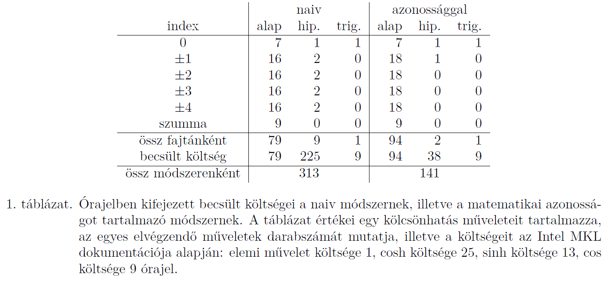

DDD szimulációk optimalizálása és korrelációk vizsgálata

- [Fordítási optimalizáció](#fordítási-optimalizáció)
  - [Mit csinálnak ezek a kapcsolók?](#mit-csinálnak-ezek-a-kapcsolók)
- [Feszültségtér optimalizációja](#feszültségtér-optimalizációja)
  - [Mennyi a végtelen?](#mennyi-a-végtelen)
    - [8](#8)
    - [4](#4)
    - [Elég ennyi?](#elég-ennyi)
  - [Miket kell kiszámolni](#miket-kell-kiszámolni)
  - [Példák](#példák)
  - [Mit nyerünk?](#mit-nyerünk)
  - [Derivált tér és még egy kicsi](#derivált-tér-és-még-egy-kicsi)
    - [olcsóbb, mint az exp](#olcsóbb-mint-az-exp)
- [Mennyi az annyi?](#mennyi-az-annyi)
  - [szép, szép, de mit mond a gyakorlat?](#szép-szép-de-mit-mond-a-gyakorlat)
- [Van-e mintázat DDD-ben?](#van-e-mintázat-ddd-ben)
  - [Mekkora legyen?](#mekkora-legyen)
    - [Egy érzékeny kiértékelő](#egy-érzékeny-kiértékelő)
  - [Diszlokcáiósűrűségek zsákutcája](#diszlokcáiósűrűségek-zsákutcája)
  - [Mennyire érzékeny?](#mennyire-érzékeny)

# Fordítási optimalizáció

Eredeti Makefileon további beállítások:

```text
set(USR_COMP_OPTIONS "-Wall -pedantic -Wextra -Wno-unknown-pragmas -Ofast -flto  -ffat-lto-objects -march=native -ffast-math")
```

## Mit csinálnak ezek a kapcsolók?

- ha bármi gyanús van, akkor álljon le:

  `-Wall -pedantic -Wextra`
- hadd használjam a commenteket region-ok definiálására (code structure), és lehessenek OS specifikus beállítások:
  
  `-Wno-unknown-pragmas`

- `-Ofast`: optimalizáld futási időre (cserébe lehet, hogy nagyobb lesz, vagy sokáig fordul)
- `flto -ffat-lto-objects`: link time optimalizáció, szélsőséges esetben akár 2-es szorzót is hozhat. A második elvileg nem kell, de mintha mégis hasznos lett volna. (az inline-t release-ben a fordító dönti el, felesleges kiírni)
- `-march=native`: ha CPU-specifikus gyorsítást lehet elérni, tedd meg (cserébe nem fog más CPU-n futni)
- `-ffast-math`: szegd meg az ieee754 szabványt a gyorsabb futásért cserébe
  - 0-val való osztás, inf és nan-ok más kezelése
  - átzárójelezés: `(a * b) * c` helyett `a * (b * c)`. Hasznos pl: `(1 * a) * 1/a` helyett `1 * (a * 1/a) = 1`
  - olcsóbb függvény használata: `pow(2.5,3)` helyett `2.5 * 2.5 * 2.5`-öt használ.

# Feszültségtér optimalizációja

Az egy diszlokációra ható erőt a periodikusan elhelyezett diszlokációfalak teréből számolhatjuk. Egy $y$ mentén, az $x=0$-ban lévő diszlokáció sor feszültségtere az $\left( {x,y} \right)$ pontban:
$${\sigma _0} = \frac{{x \cdot \left[ {\cosh \left( {2\pi  \cdot x} \right) \cdot \cos \left( {2\pi  \cdot y} \right) - 1} \right]}}{{{{\left[ {\left( {\cosh \left( {2\pi  \cdot x} \right) - \cos \left( {2\pi  \cdot y} \right)} \right)} \right]}^2}}}$$

A periodikus határfeltételt úgy vehetjük figyelembe, hogy ilyen falakat teszünk le 1 távolságra $x =  \pm 1$, $x =  \pm 2$, \ldots helyekre, így az eredő feszültségtér:
$${\sigma _0} = \sum\limits_{i =  - \infty}^\infty {\frac{{\left( {x + i} \right) \cdot \left[ {\cosh \left( {2\pi  \cdot \left( {x + i} \right)} \right) \cdot \cos \left( {2\pi  \cdot y} \right) - 1} \right]}}{{{{\left[ {\left( {\cosh \left( {2\pi  \cdot \left( {x + i} \right)} \right) - \cos \left( {2\pi  \cdot y} \right)} \right)} \right]}^2}}}}.$$


## Mennyi a végtelen?

$${\sigma _0} = \sum\limits_{i =  - \infty}^\infty {\frac{{\left( {x + i} \right) \cdot \left[ {\cosh \left( {2\pi  \cdot \left( {x + i} \right)} \right) \cdot \cos \left( {2\pi  \cdot y} \right) - 1} \right]}}{{{{\left[ {\left( {\cosh \left( {2\pi  \cdot \left( {x + i} \right)} \right) - \cos \left( {2\pi  \cdot y} \right)} \right)} \right]}^2}}}}.$$

### 8

Ha $i=8$, akkor a kiszámolt tér double precision mértékig pontos, azaz $i=9$ nem lesz már pontosabb.

### 4

Viszont már a 4 is elég az eredményeket a direkt térben tekintve. 

### Elég ennyi?

Ez az egyik legszámításigényesebb lépés a szimulációban. Ki kell számolni sok $\cosh$ függvényértéket, ami a legköltségesebb: [Intel MKL optimalizált](https://software.intel.com/en-us/mkl-vmperfdata-performance-of-all-real-vm-functions) függvényeiben 25 órajel, míg a szorzás $0.3$ (vektorra).

## Miket kell kiszámolni

Lássuk, mely halmaz értékeit kell kiszámolni:
$${C_x} = \left\{ {\cosh \left( {2\pi  \cdot \left( {x + i} \right)} \right)| - 4 \leqslant i \leqslant 4} \right\}.$$

Azonban használhatjuk a hiperbolikus függvények azonosságát, miszerint
$$\cosh \left( {x + y} \right) = \cosh \left( x \right) \cdot \cosh \left( y \right) + \sinh \left( x \right) \cdot \sinh \left( y \right),$$
így az összesen 9 hiperbolikus függvényből csak 2-t kell kiszámolni (az egyik ráadásul $\sinh$, ami még olcsóbb is), egyszer ${\cosh \left( {2\pi x} \right)}$-et, egyszer pedig ${\sinh \left( {2\pi x} \right)}$-et. A többi érték konstans, ugyanaz diszlokációról diszlokációra, azokat eltárolhatjuk a memóriában.

## Példák

$$\begin{aligned}
  \cosh \left( {2\pi x + 0 \cdot 2\pi } \right) &  = \underline {\cosh \left( {2\pi x} \right)}  \\ 
  \cosh \left( {2\pi x + 1 \cdot 2\pi } \right) &  = \underline {\cosh \left( {2\pi x} \right)}  \cdot \cosh \left( {2\pi } \right) + \underline{\underline {\sinh \left( {2\pi x} \right)}}  \cdot \sinh \left( {2\pi } \right) \\ 
  \cosh \left( {2\pi x - 1 \cdot 2\pi } \right) &  = \underline {\cosh \left( {2\pi x} \right)}  \cdot \cosh \left( {2\pi } \right) - \underline{\underline {\sinh \left( {2\pi x} \right)}}  \cdot \sinh \left( {2\pi } \right) \\ 
  \cosh \left( {2\pi x + 2 \cdot 2\pi } \right) &  = \underline {\cosh \left( {2\pi x} \right)}  \cdot \cosh \left( {4\pi } \right) + \underline{\underline {\sinh \left( {2\pi x} \right)}}  \cdot \sinh \left( {4\pi } \right) \\ 
  \cosh \left( {2\pi x - 2 \cdot 2\pi } \right) &  = \underline {\cosh \left( {2\pi x} \right)}  \cdot \cosh \left( {4\pi } \right) - \underline{\underline {\sinh \left( {2\pi x} \right)}}  \cdot \sinh \left( {4\pi } \right) \\ 
  \cosh \left( {2\pi x + 3 \cdot 2\pi } \right) &  = \underline {\cosh \left( {2\pi x} \right)}  \cdot \cosh \left( {6\pi } \right) + \underline{\underline {\sinh \left( {2\pi x} \right)}}  \cdot \sinh \left( {6\pi } \right) \\ 
  \cosh \left( {2\pi x - 3 \cdot 2\pi } \right) &  = \underline {\cosh \left( {2\pi x} \right)}  \cdot \cosh \left( {6\pi } \right) - \underline{\underline {\sinh \left( {2\pi x} \right)}}  \cdot \sinh \left( {6\pi } \right) \\ 
  \cosh \left( {2\pi x + 4 \cdot 2\pi } \right) &  = \underline {\cosh \left( {2\pi x} \right)}  \cdot \cosh \left( {8\pi } \right) + \underline{\underline {\sinh \left( {2\pi x} \right)}}  \cdot \sinh \left( {8\pi } \right) \\ 
  \cosh \left( {2\pi x - 4 \cdot 2\pi } \right) &  = \underline {\cosh \left( {2\pi x} \right)}  \cdot \cosh \left( {8\pi } \right) - \underline{\underline {\sinh \left( {2\pi x} \right)}}  \cdot \sinh \left( {8\pi } \right) \\ 
\end{aligned}$$

## Mit nyerünk?



## Derivált tér és még egy kicsi

A derivált térre ugyanígy alkalmazható az azonosság, $\cosh \to \sinh$:

$$\sinh \left( {2\pi x \pm n \cdot 2\pi } \right) = \sinh \left( {2\pi x} \right) \cdot \cosh \left( {2n\pi } \right) \pm \cosh \left( {2\pi x} \right)\sinh \left( {2n\pi } \right).$$

Nem lehetne a hiperbolikus $\sinh, \cosh$ függvények helyett még valami olcsóbbat? De! Használjuk az **exp** függvényt!

$$\cosh \left( x \right) = \frac{{{e^x} + {e^{ - x}}}}{2}\qquad \sinh \left( x \right) = \frac{{{e^x} - {e^{ - x}}}}{2}$$

Az exp fele annyiba kerül mint a cosh (mondjuk a sinh még az expnél is olcsóbb valahogy), és ${e^{ - x}} \approx 1/{e^x}$. Nem lehetne még olcsóbb? De!

### olcsóbb, mint az exp

$${e^x} = {2^{\frac{x}{{\ln \left( 2 \right)}}}}$$

# Mennyi az annyi?

15-ös szorzó sebességben!

15 hét alatt csak 1? Nem, mert ez csak a számolás egyik része :(

$$A + B = C \to \frac{A}{{15}} + B \ne \frac{C}{{15}}$$

Ezért nem elég csak A-ban nézni az eredményt, hanem C-ben érdemes!

## szép, szép, de mit mond a [gyakorlat](https://github.com/danieltuzes/2D4/wiki/Speedtests)?

Hozzávetőleges sebességnövekedés a funkciók bevezetésének sorrendjében:

- optimalizált kapcsolók: x2
- hiperbolikus függvények: x5 ... x1.8
- Optimalizált Jakobi: 30% - 10%
- 2-es hatvány: x1.2
- diszlokációk sorrendben: kb 1-3%

# Van-e mintázat DDD-ben?

## Mekkora legyen?

Mekkora szimulációt kell futtatni? Azt szeretném, ha legalább 3 db minta beleférne, a diszlokációmintázatban a jellemző hullámhossz a diszlokációk átlagos távolságának kb. tízszerese, tehát a szimulációs tér legalább $30 \times 30 \approx 1024$ diszlokáció kell.

| Falak száma   | 3    | 4.24 | 6    | 8.48 | 12    | 16.97 | 24    | 33.94  |
| ------------- | ---- | ---- | ---- | ---- | ----- | ----- | ----- | ------ |
| rendszerméret | 1024 | 2048 | 4096 | 8192 | 16384 | 32768 | 65536 | 131072 |

### Egy érzékeny kiértékelő

Ha lesz minta, mi mutatja meg? Mennyire érzékeny? Hogyan ellenőrizhető?

Nézzük a Fourier-térben a hullámszám-vektorokat! Okok, de melyik térnek? Hogyan lesz sűrűség-tér?

## Diszlokcáiósűrűségek zsákutcája

Rendeljünk egy diszkrét térhez sűrűségfüggvényeket! Hogyan? [Sokféleképpen lehet megtenni](../xpattern/README.md).

A legjobb, ha ki sem számoljuk a sűrűség-teret, hanem alkalmazzuk a Dirac-delta disztribúció azonosságát.

$$\mathcal{F}\left( {{k_x},{k_y}} \right) = \sum\limits_{i = 1}^N {{e^{ - 2\pi i\left( {{k_x} \cdot {x_i} + {k_y} \cdot {y_i}} \right)}}}.$$

## Mennyire érzékeny?

1000 db véletlen eloszlás és 1000 db [szándékosan mintáztatott eloszlás](../init_config_gen/README.md).

- Ha nincs mintázat, akkor [zajt látunk](kappa_random.png).
- Ha van minta, akkor az [eléggé kiemelkedik](kappa_mintázatos.png).
  
  Összevetve a többi módszerrel csak kiátlagolt $k_y$ mellett lehetséges.
  
  - [Szármzatott mintázat esetén](Fourier_transforms_diff.pdf) a box countingot leszámítva mindegyik jó, **1%** mellett!
  - Ha a mintázatokat [random seed-ből nézem](Fourier_transforms_diff_rand.pdf), akkor **5%** mintázat kell