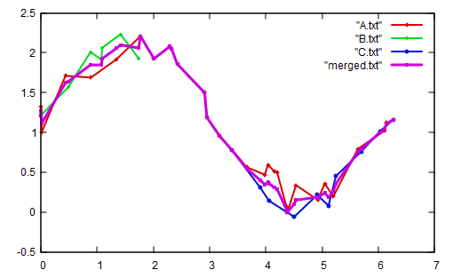

# 2D4\::sandbox::merge_data_func
Merging and averaging functions as data sets. This is a tool from 2D4, a dislocation simulation toolset.

## Description
If a function f(x) evaluated in a measurement called *a* in x1,a, x2,a, ... and then in measurement *b* in x1,b, x2,b, ... this program merges and average the data. Evaluation points will be x1,(a,b), x2,(a,b), x3,(a,b), x4,(a,b), .... where the evaluation points are the union of the original sets and they are in increasing order. The value f from the different series are averaged at the points of the union set. If no f value is given in that series for that evaulation point, its value is linearly interpolated from the surroundings.

## Features
The program takes care of the following cases.
* Different files contains different number of columns, but each file in each row must contain enough number of columns.
* Different data sets start and end at different *x* values, therefore the number of averaged values can be different.
* The represented number in the file can be written in the exponential format like 1.2e-5.
* Empty lines are allowed and values are considered consecutive, i.e. the values on the edges are connected.

### File format
The program reads in the files as text files. In each row the *x* and *y* value(s) should be found, in the same order row by row. Rows are delimited by the OS dependent new line character. Columns are read in one by one delimited by any number of whitespace character (except new line). E.g. a value after two whitespace character behaves the same as if there were only one whitespace character. Non whitespace characters are evaluated only if the column is either the *x* value or (one of) the requested *y* value(s).

The program is almost as simple as it can be and unexpected input can lead to unexpected results. E.g., if a column does not contain the value(s) it supposed to look for (i.e., it contains only 2 values but the 3rd column was asked with the `-y 3` switch), it will be substituted with zero(s).

## Usage
The first argument(s) must be the name of the files to average. If only one filename is provided, it must be a filename with `.ini` ending containing the list of filenames of files to compare, separated with any type and number of whitespace. If input filename is not provided, it can be given during runtime.

Further options:
* `--x_column arg` or `-x arg`: the index of the column containing the *x* values in the files. The index of the first column is 0 and this is the default value.
* `--y_columns arg` or `-y arg`: the index(es) of the column(s) containing the (different) *y* values in the files. The index of the first column is 0. Default value is 1. If more values are give, like `-y 1 2`, then both columns will be independently evaluated and averaged.
* `--output-filename arg` or `-O arg`: the name of the output file. If no value is provided, then the standard output will be used.

## Example
In the folder `example` a simple case can be found. The program was called as

   `merge_data_func.exe A.txt B.txt C.txt -O merged.txt -y 1 2 `
and the program processed files `A.txt`, `B.txt` and `C.txt`, and produced `merged.txt`. All of the original files contained a noisy sinusoidal and cosinusoidal functions and they are partly overlapping. Plotting only the sinusoidal value files and result file is shown below.

