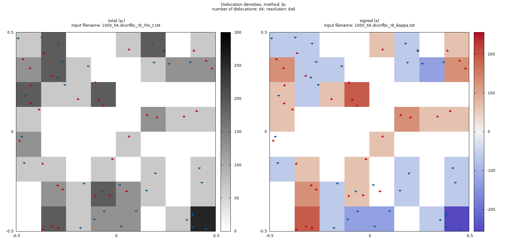
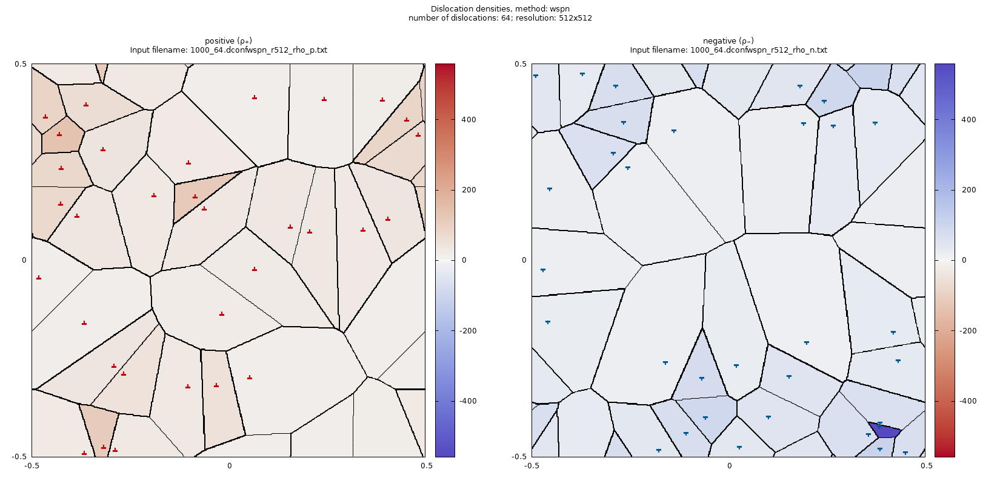
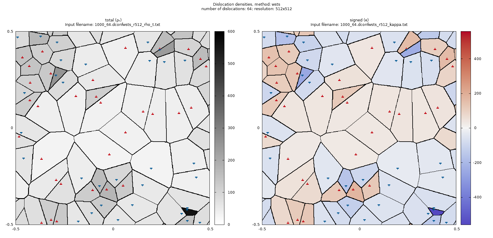

# 2D4::xpattern
This is an advanced pattern finder for 2D dislocation configurations. Such configurations are created by 2D4::init_config_gen and used by 2D4\::2D_DDD_simulation.

## Dependencies
* FFTW
* boost/program_options

## Parameters
* `--input-path` or `-i`: **mandatory argument**, the input filename containing the dislocation configuration (ending in `.dconf`) or the file containging the input filenames (ending in `.ini`) 1 filename per line.
* `--resolution` or `-r` (1024): the Fourier transform will be calculated in this many points. (The Fourier will contain 1 extra value.) 
* `--method` or `-m`: how the dislocation density should be calulated. There are 3 different possibilities:
  * `bc`: box counting. A mesh with resolution × resolution number of cells are created and in each cell the dislocation densities are calculated based on how many dislocations can be found inside the cell.
  * `gc`: Gauss convolution. Each dislocation is represented with a Gauss-distribution of half-width `-half-width`. The distribution is a periodic repetition of a Gauss-distributions instead of sum of periodic images, therefore, it is not an exact peroidic convolution (e.g. the derivatives are not continuous), nor normalized. This is not a problem if half-width ≪ 1. The densities are sampled in the centerpoint of the mesh and due to the discrete sampling, the distribution is again not normalized, it is ensured after the calculation: ρ₊ and ρ₋ are calculated separatedly and normalized, then comes the calculation of ρt and κ.
    
    Technically, a discrete cut-off is also applied on the distribution: it is considered to be exactly 0 if the distance in the *x* or in the *y* direction is more than 6 * `half-width`.

  * `wspn`: Wigner-Seitz positive and negative. The simulation space is meshed up to domains based on the Wigner-Seitz cell structure of the set of positive and negative dislocations. The positive ρ₊ and negative ρ₋ dislication density is then 1 / the size of the cell. The total dislocation density ρt and signed dislocation κ density are the derived quantities, calculated by the sum and difference of these maps.
  * `wsts`: Wigner-Seitz total and signed. Like `wspn`, but the total dislocation density ρt and signed dislocation density κ will be calculated directly and ρ₊ and ρ₋ are the derived quantities.
  * `df`: direct Fourier. Instead of approximating the desnity function, one can directly calculate the Fourier transform is discrete Dirac deltas.
* `--sub-sampling` or `-s` (1): increases the size of the mesh to calculate the densities, but the resolution remains the same. Instead of calculating the densities on a mesh with size resolution × resolution, it is calculated on a mesh with size (s·r) × (s·r). This paramterer takes effect only for Gauss convolution and Wigner-Seitz methods.
* `--half-width` or `-w`: half-width of the Gauss distribution used in the Gauss convolution method. The hald-width is measured in the units of the simulation space units.
* `--output-foldername` or `-o` (""): the output foldername relative to the executable.

## Methods
### Box counting
The space is partitioned into `resolution` × `resolution` number of squares and in each square all the 4 dislocation densities are calculated. The density is the number of corresponding dislocations / area of the cell = `resolution` × `resolution` × the number of corresponding dislocations.

ρt and κ are plotted in the figure below. The size of the box is the average dislocation distance.

ρ+ and ρ- are plotted below.

### Gauss-smoothening
The space is partitioned into `resolution` × `resolution` number of squares and each square is divided into `resolution` × `resolution` number of subcells. Each dislocation represents a density with a Gauss-distribution characterized by `half-width`. All the dislocation distributions are evaluated at the left bottom point of each subcell and added togather. The density of a cell is the sum of the density of its subcells. The density over the whole space is normalized afterwards.

It is suggested to use subcell size smaller than the `half-width`, otherwise, dislocations which are the closest to the evaluation points will get overrepresented.

ρt and κ are plotted in the figure below. The size of the box is the average dislocation distance and a `--sub-sampling 4` and `--half-width 0.125` were used.

ρ+ and ρ- are plotted below.

By keeping a fair `half-width` × `sub-sampling` × `resolution` = 4 value and making a `subs-sampling` → ∞, `half-width` → 0 limit, one gets back the boxcounting case.

### Wigner-Seitz positive and negative

The positive and negative dislocations form different sets when their density is being evaluated. In `resolution` × `resolution` number of points the space is analyzed and the dislocation is identified to which that point the closest is. Grouping the points together which are closest to the same dislocation defines a cell, the so-called (discrete) Wigner-Seitz cell of the dislocation. The area of the cell is proportional to the number of points in the cell. The density is then 1 / area.

With the *positive and negative* method, the Wigner-Seitz partitioning is applied only on the set of positive dislocations first, and then on the negative dislocations giving the dislocation density for positive and negative dislocations. The total and signed density are calculated as the sum and difference of the two. Note that ρ+ and ρ- can never be 0.

In the picture below this partitioning can be seen for a dislocation configuration containing 64 dislocations. (This configuration can be obtained with [2D4::init_config_gen](https://github.com/danieltuzes/2D4/tree/master/init_config_gen) using `-N 64`, i.e., with seed value `-S 1000`.)

The total and signed dislocation density is calculated and does not use Wigner-Seity partitioning, therefore, regions with constant densities may belong to no dislocation or to two dislocations, i.e., it is not partitioning (no walls are plotted accordingly). Also note that κ=0 is possible.

These maps can be averaged on a mesh with 8×8 number of cells to get a similar picture like before. The most important feature of this method is that not only empty zooming happens after reaching the average dislocation spacing with the resoulution, but useful information can be obtained until the area of the smallest cell is properly resolved. This means one can get the most information of their simulation and to show any pattern formation the least number of simulations are required.

### Wigner-Seitz total and signed
In contrast to the *positive and negative* case, here, densities are calculated using all the dislocations at once. That means that Wigner-Seitz cells are identified first, and the total dislocation density of the cell is calculated as 1 / area, the signed dislocation density is dislocation sign / area. ρ+ is either equal to ρt or 0 and same applies to ρ-. Furthermore, |κ| = ρ holds (pointwise) and none of them can be 0.

In the picture below, the ρt and κ are presented. These are the primary quantities calculated using the Wiger-Seitz partitioning.

ρ+ and ρ- are derived quantities, they are calculated in a trivial manner. In both cases one gets a partial partitioning.

### Direct Fourier
While all the previous methods rely on approximating the density function, one can calculate the Fourier components directly by applying the formula of Fourier-transformation on the distribution Dirac-delta. In this case, the whole 𝐤 map must be calculated. Then, the relevant pattern in the x direction can be obtained by averaging the norm of the Fourier components at the given kx value for all different ky values. In this case, the Fourier component ℱ(kx,ky) is the sum of exp( -2*π*i * (kx * xi + ky * yi )), where xi and yi is the position of the *i*th dislocation.